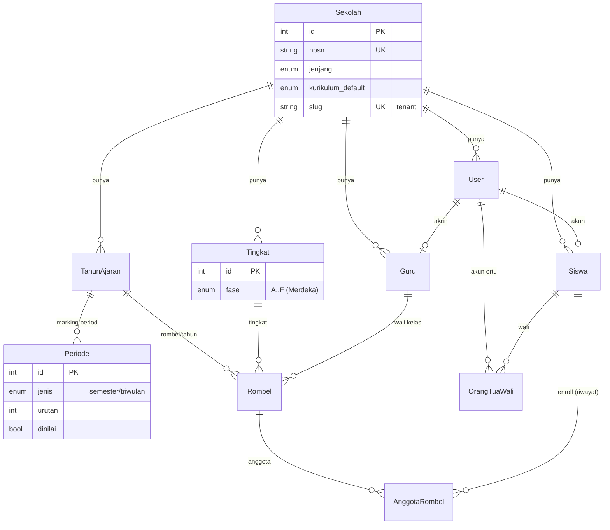
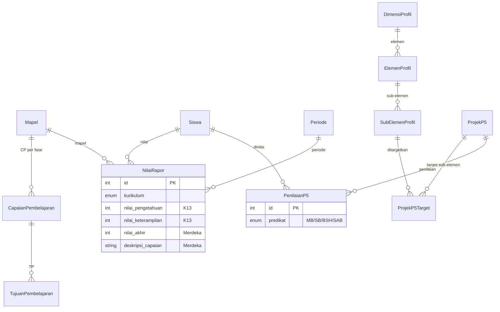
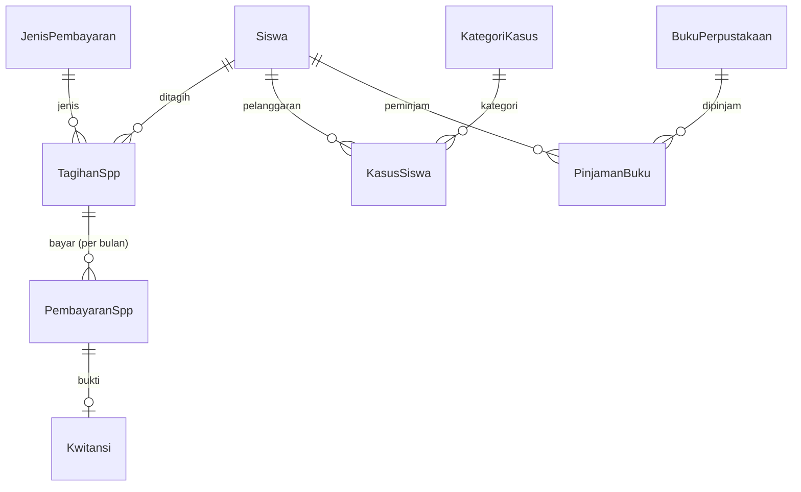

# Desain Skema v2 & ERD — Smart School (Multi-Tenant SaaS)

> Target: **PostgreSQL (Supabase/lokal) + Prisma + Next.js/TypeScript**.
> Artifact: [prisma/schema.prisma](../prisma/schema.prisma) — **valid & ter-push** ke DB lokal (68 tabel, 14 enum).
> Dasar: [AUDIT.md](AUDIT.md), [RESEARCH.md](RESEARCH.md). Diperbarui: 2026-06-03.

## Status

| Item | Status |
|---|---|
| `prisma validate` | ✅ valid |
| `prisma db push` ke `websekolah_dev` (lokal) | ✅ 68 tabel + 14 enum dibuat |
| Migrasi data lama (ETL) | ⏳ belum |
| RLS multi-tenant | 🧩 template di [prisma/rls.sql](../prisma/rls.sql), difinalkan saat auth |

---

## 1. Keputusan Produk (dikonfirmasi user, 2026-06-03)

| Keputusan | Pilihan | Dampak skema |
|---|---|---|
| **Jenjang** | Fleksibel semua jenjang (SD–SMA) | struktur akademik data-driven (`Tingkat.fase`, `Periode`) |
| **Kurikulum** | Merdeka **+** K13 | `NilaiRapor` punya field kedua mode + `kurikulum` discriminator; modul P5 |
| **Cakupan** | Multi-sekolah (SaaS) | `sekolah_id` di semua entity tenant + RLS |
| **Portal ortu** | Ya | `OrangTuaWali.userId` + role `ortu` |

---

## 2. Prinsip Desain (rangkuman, detail di RESEARCH.md)

1. **Multi-tenant** — `Sekolah` = tenant root (NPSN, jenjang, kurikulum, + profil). Tiap tabel tenant punya `sekolah_id`; isolasi via **RLS**.
2. **Auth tunggal** — `users` (bcrypt) menggantikan `tbl_users` + 13 login + password tersebar. Role termasuk `superadmin`, `ortu`.
3. **Struktur akademik data-driven** — `TahunAjaran` → `Periode` (marking period: semester/triwulan), `Tingkat` (+`fase` A–F). Tidak ada lagi "semester 1–6" hardcode.
4. **Enrollment berbasis riwayat** — `Rombel` (rombongan belajar per tahun) + `AnggotaRombel` menggantikan `kelas`+`walikelas`+`siswa.kelas_id`.
5. **Dukung 2 kurikulum** — `NilaiRapor`: `nilaiPengetahuan/nilaiKeterampilan` (K13) **dan** `nilaiAkhir/deskripsiCapaian` (Merdeka). Plus `CapaianPembelajaran`/`TujuanPembelajaran`.
6. **P5 lengkap** — `DimensiProfil`→`ElemenProfil`→`SubElemenProfil` (referensi nasional, global), `ProjekP5`+`ProjekP5Target`+`PenilaianP5` (predikat MB/SB/BSH/SAB).
7. **Align Dapodik** — NPSN, NISN, NIK, NUPTK, istilah PTK/Rombel.
8. **Normalisasi** — `pendaftar`→`siswa`+`orang_tua_wali`+...; `rapor1–6`→`nilai_rapor`+`periode`; `spp bayar1–12`→`tagihan_spp`(bulan)+`pembayaran_spp`.

---

## 3. ERD — Tenant & Akademik

## 4. ERD — Penilaian (K13 + Merdeka + P5)

## 5. ERD — Operasional (Keuangan, BK, Perpustakaan)

---

## 6. Daftar Entity (68 tabel)

| Domain | Model |
|---|---|
| Tenant/Profil | `Sekolah` |
| Auth | `User`, `LogLogin` |
| Akademik | `TahunAjaran`, `Periode`, `Tingkat`, `Rombel`, `AnggotaRombel` |
| Siswa | `Siswa`, `OrangTuaWali`, `BeasiswaSiswa`, `PrestasiSiswa` |
| Guru/PTK | `Guru`, `PendidikanGuru`, `Ekinerja`, `Skp` |
| Mapel/Nilai | `Mapel`, `CapaianPembelajaran`, `TujuanPembelajaran`, `NilaiRapor`, `NilaiRaporEkstra` |
| P5 | `DimensiProfil`, `ElemenProfil`, `SubElemenProfil`, `ProjekP5`, `ProjekP5Target`, `PenilaianP5` |
| KBM | `Hari`, `JadwalGuru`, `JurnalGuru`, `Elearning`, `LatihanSoal`, `VideoPembelajaran`, `BukuDigital`, `MenuSiswa` |
| Kehadiran | `KehadiranSiswa`, `KehadiranGuru`, `SettingKehadiran` |
| BK | `KategoriKasus`, `KasusSiswa`, `MutasiSiswa`, `UndanganOrtu` |
| Keuangan | `JenisPembayaran`, `KodeRekening`, `TagihanSpp`, `PembayaranSpp`, `Kwitansi` |
| Perpustakaan | `BukuPerpustakaan`, `PinjamanBuku`, `PengunjungPerpustakaan` |
| Sarpras | `KategoriSarpras`, `Sarpras` |
| PPDB | `JalurPpdb`, `PendaftaranPpdb`, `KetentuanPpdb` |
| Kelulusan | `Kelulusan`, `SettingKelulusan` |
| OSIS | `CalonOsis`, `VotePemilihan` |
| Administrasi | `Surat`, `SuratKeteranganAktif`, `Tamu`, `BukuTamu`, `Alumni` |
| Sistem | `Setting`, `SettingBanner`, `Tema`, `Counter` |

> Pemetaan detail tabel lama → baru: lihat versi sebelumnya & [RESEARCH.md](RESEARCH.md) §4. Inti: 70 tabel lama → 68 model baru *yang berelasi & bertipe benar + multi-tenant + 2 kurikulum* (bukan sekadar reduksi jumlah, tapi penambahan kapabilitas).

---

## 7. Langkah Berikutnya

1. **Seed referensi nasional** — `DimensiProfil`/`ElemenProfil`/`SubElemenProfil` (6 dimensi Profil Pelajar Pancasila), + 1 `Sekolah` contoh + tingkat/fase sesuai jenjang.
2. **Scaffold Next.js** (App Router + TS) + integrasi Prisma Client + Auth.js (role + tenant).
3. **Finalkan RLS** ([prisma/rls.sql](../prisma/rls.sql)) sesuai mekanisme auth.
4. **Script ETL** `smartschool.sql` (lama) → skema baru: hash ulang password (MD5→bcrypt), pecah `pendaftar`, gabung `rapor1–6`→`nilai_rapor`, `bayar1–12`→`tagihan_spp`, map ke 1 `sekolah_id`.
5. **Migrasi DB resmi** — ganti `db push` dengan `prisma migrate dev` (versioned migration) sebelum produksi.
